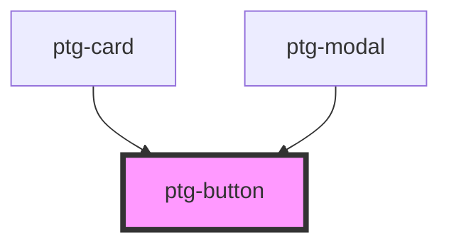

# ptg-button

<!-- Auto Generated Below -->

## Properties

| Property           | Attribute            | Description | Type     | Default     |
| ------------------ | -------------------- | ----------- | -------- | ----------- |
| `appearance`       | `appearance`         |             | `string` | `undefined` |
| `btnIconAlignment` | `btn-icon-alignment` |             | `string` | `'right'`   |
| `text`             | `text`               |             | `string` | `""`        |

## Dependencies

### Used by

 - [ptg-card](../ptg-card)
 - [ptg-modal](../ptg-modal)

### Graph

----------------------------------------------

*Built with [StencilJS](https://stenciljs.com/)*
