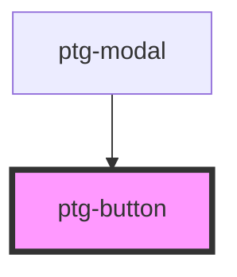

# ptg-button

<!-- Auto Generated Below -->

## Properties

| Property     | Attribute    | Description | Type     | Default     |
| ------------ | ------------ | ----------- | -------- | ----------- |
| `appearance` | `appearance` |             | `string` | `undefined` |
| `text`       | `text`       |             | `string` | `undefined` |

## Dependencies

### Used by

 - [ptg-modal](../ptg-modal)

### Graph

----------------------------------------------

*Built with [StencilJS](https://stenciljs.com/)*
