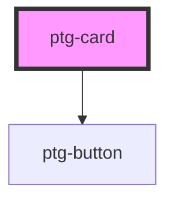

# ptg-card

<!-- Auto Generated Below -->

## Properties

| Property            | Attribute             | Description | Type      | Default     |
| ------------------- | --------------------- | ----------- | --------- | ----------- |
| `cardButtonText`    | `card-button-text`    |             | `string`  | `'select'`  |
| `cardContent`       | `card-content`        |             | `string`  | `''`        |
| `cardContentLength` | `card-content-length` |             | `number`  | `undefined` |
| `cardId`            | `card-id`             |             | `number`  | `undefined` |
| `cardTitle`         | `card-title`          |             | `string`  | `''`        |
| `isCardAction`      | `is-card-action`      |             | `boolean` | `false`     |
| `src`               | `src`                 |             | `string`  | `''`        |

## Events

| Event         | Description | Type               |
| ------------- | ----------- | ------------------ |
| `handleClick` |             | `CustomEvent<any>` |

## Dependencies

### Depends on

- [ptg-button](../ptg-button)

### Graph

----------------------------------------------

*Built with [StencilJS](https://stenciljs.com/)*
