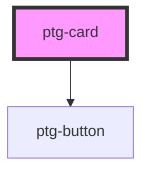

# ptg-card

<!-- Auto Generated Below -->

## Properties

| Property      | Attribute      | Description | Type     | Default     |
| ------------- | -------------- | ----------- | -------- | ----------- |
| `cardContent` | `card-content` |             | `string` | `''`        |
| `cardId`      | `card-id`      |             | `number` | `undefined` |
| `cardTitle`   | `card-title`   |             | `string` | `''`        |
| `src`         | `src`          |             | `string` | `''`        |

## Events

| Event         | Description | Type               |
| ------------- | ----------- | ------------------ |
| `handleClick` |             | `CustomEvent<any>` |

## Dependencies

### Depends on

- [ptg-button](../ptg-button)

### Graph

----------------------------------------------

*Built with [StencilJS](https://stenciljs.com/)*
