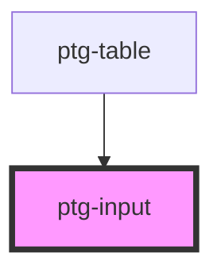

# my-input

<!-- Auto Generated Below -->

## Properties

| Property      | Attribute     | Description     | Type     | Default     |
| ------------- | ------------- | --------------- | -------- | ----------- |
| `inputId`     | `input-id`    | id for input    | `string` | `undefined` |
| `label`       | `label`       | label for inout | `string` | `undefined` |
| `name`        | `name`        | name for inout  | `string` | `undefined` |
| `placeholder` | `placeholder` | The placeholder | `string` | `''`        |
| `type`        | `type`        | type of input   | `string` | `undefined` |
| `value`       | `value`       | name for inout  | `string` | `''`        |
| `width`       | `width`       |                 | `string` | `'100%'`    |

## Events

| Event          | Description                     | Type                  |
| -------------- | ------------------------------- | --------------------- |
| `valueChanged` | Event emmiter to handle changes | `CustomEvent<string>` |

## Dependencies

### Used by

 - [ptg-table](../ptg-table)

### Graph

----------------------------------------------

*Built with [StencilJS](https://stenciljs.com/)*
