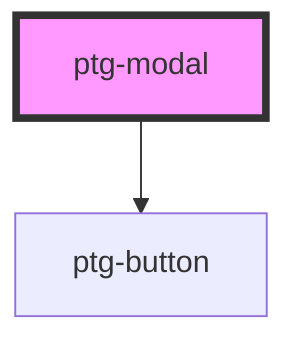

# ptg-modal

<!-- Auto Generated Below -->

## Properties

| Property            | Attribute             | Description | Type      | Default          |
| ------------------- | --------------------- | ----------- | --------- | ---------------- |
| `btnName`           | `btn-name`            |             | `string`  | `'Open Modal'`   |
| `confirmButtonName` | `confirm-button-name` |             | `string`  | `'Confirm'`      |
| `isOpen`            | `is-open`             |             | `boolean` | `false`          |
| `modalHeaderName`   | `modal-header-name`   |             | `string`  | `'Modal Header'` |
| `modalSize`         | `modal-size`          |             | `string`  | `'md'`           |
| `showFooter`        | `show-footer`         |             | `boolean` | `true`           |
| `showHeader`        | `show-header`         |             | `boolean` | `true`           |

## Events

| Event            | Description | Type                   |
| ---------------- | ----------- | ---------------------- |
| `onConfirmClose` |             | `CustomEvent<boolean>` |
| `onModalClose`   |             | `CustomEvent<boolean>` |

## Dependencies

### Depends on

- [ptg-button](../ptg-button)

### Graph

----------------------------------------------

*Built with [StencilJS](https://stenciljs.com/)*
