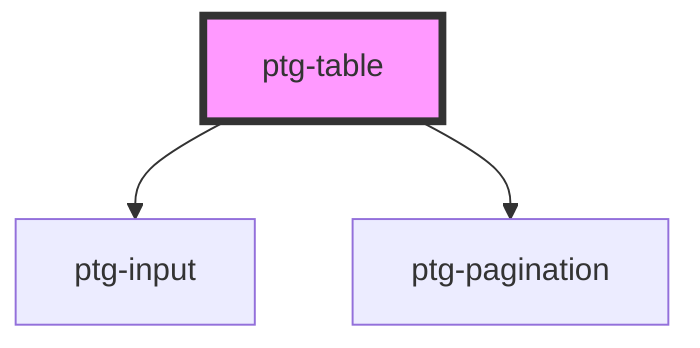

# ptg-table

<!-- Auto Generated Below -->

## Properties

| Property          | Attribute      | Description | Type       | Default     |
| ----------------- | -------------- | ----------- | ---------- | ----------- |
| `customClass`     | `custom-class` |             | `string`   | `undefined` |
| `pageSizeOptions` | --             |             | `number[]` | `[]`        |
| `searchable`      | `searchable`   |             | `boolean`  | `false`     |
| `sortable`        | `sortable`     |             | `boolean`  | `false`     |
| `tableHover`      | `table-hover`  |             | `boolean`  | `undefined` |
| `tableStrip`      | `table-strip`  |             | `boolean`  | `undefined` |
| `tablecolumn`     | `tablecolumn`  |             | `any`      | `undefined` |
| `tabledata`       | `tabledata`    |             | `any`      | `undefined` |
| `tabletitle`      | `tabletitle`   |             | `string`   | `undefined` |
| `themeColor`      | `theme-color`  |             | `string`   | `undefined` |

## Dependencies

### Depends on

- [ptg-input](../ptg-input)
- [ptg-pagination](../ptg-pagination)

### Graph

----------------------------------------------

*Built with [StencilJS](https://stenciljs.com/)*
