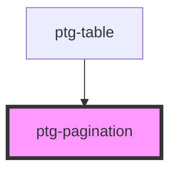

# ptg-pagination

<!-- Auto Generated Below -->

## Properties

| Property          | Attribute    | Description | Type       | Default     |
| ----------------- | ------------ | ----------- | ---------- | ----------- |
| `itemCount`       | `item-count` |             | `number`   | `undefined` |
| `page`            | `page`       |             | `number`   | `0`         |
| `pageSize`        | `page-size`  |             | `number`   | `10`        |
| `pageSizeOptions` | --           |             | `number[]` | `[]`        |

## Events

| Event         | Description | Type               |
| ------------- | ----------- | ------------------ |
| `pageChanged` |             | `CustomEvent<any>` |
| `sizeChanged` |             | `CustomEvent<any>` |

## Dependencies

### Used by

 - [ptg-table](../ptg-table)

### Graph

----------------------------------------------

*Built with [StencilJS](https://stenciljs.com/)*
